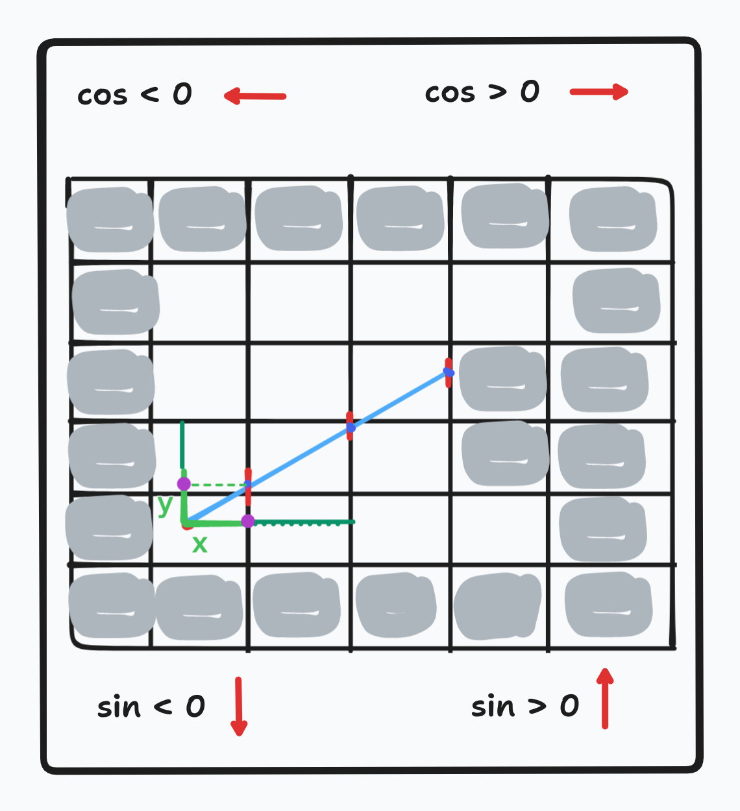
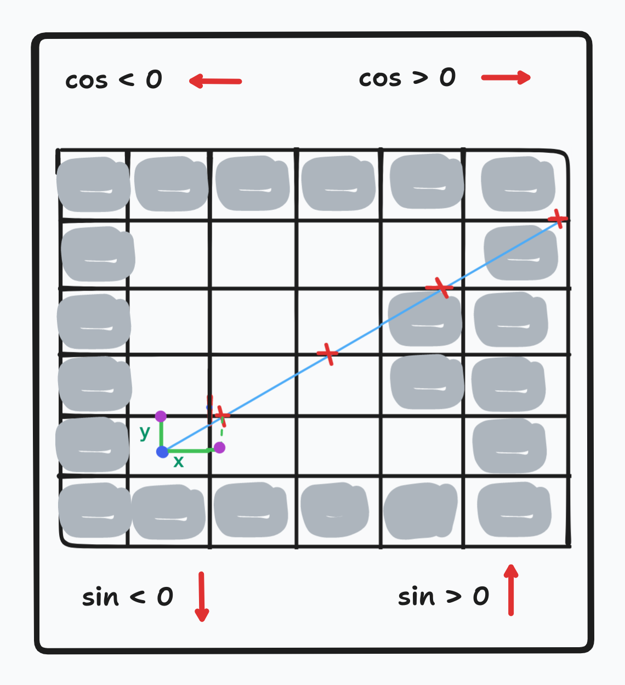

<div align="center">
  <h1 style="text-align: center;">Cub3D</h1>
</div>

## cub3D is a project of `42cursus`, in cub3D we work as a team of tow student

- ## how to run the program cub3D_bonus
  - first if you dont have the mlx library in your device you should install it if you are interested
  	- [install mlx 42](https://harm-smits.github.io/42docs/libs/minilibx/getting_started.html#installation) 
  -  run this command bellow to create an executable named cub3D_bonus
  	```
  	make bonus
  	```
  - then run this command bellow you can change the file `maps/map_bonus.cub`
	by any file existing in folder `maps` like `maps/simpe_map.cub`
	```
	./cub3d_bonus maps/map_bonus.cub
	```
## PLANING
- ## Parcine

	- parce first element
	- parce map

- ## Ray_cast
	- draw a simple 2D game that have three elements player `P` and walls `1` and free spaces `0`
 		- draw the walls and free spaces as a squeres, You can also draw the player as a square, but it is better to draw him in a circular shape
	- make the player `P` move in the free spaces `0` and not in the walls `1` 
	- put one ray from the center of player shape, just a small ray for testing
	- make this previos ray rotate
	- determine the direction `N` or `S` or `W` or `E`
	***
	- determine the coordinates `there is thre steps`
		- `1` determine coordinates that is represent a wall at the intersictions with __x__
		- `2` determine coordinates that is represent a wall at the intersictions with __y__
			- in the two steps above you should create a function that calculate the coord `(x,y)`
				and other one that check if you can  move to this coordinates
		- `3` choice the coordinates that have a ray __R__ less than other
	- make the ray stop if there are a wall in the next position

*** 
### relationships of trigonometric circle

		cos(o) = x/R           &&             sin(o) = y/R


		tan(o) = sin(o)/cos(o)      =>        tan(o) = y/x


		x = y/tan(o)           &&             y = tan(o)*x


***


### determine the coordonate of intersiction with y

### determine the coordonate of intersiction with x

***
- ## Draw Walls
	- darwing walls
 	- calculate the hiegth of wall `H_wall = grid_size * H_window / R`
  	 you can use other method to calculate the height of wall but you should
  	 divise by R alwys
    	- then drawing the walls, for every ray there is a wall with `1 px` in the width and ther height is `H_wall px`
	- draw walls with texturs

---
#### link of github repo -> [ayoub-elidryssy](https://github.com/gxxpython/cub)
### sum sources
[RAYCAST TOTURIAL](https://permadi.com/1996/05/ray-casting-tutorial-table-of-contents/) 


