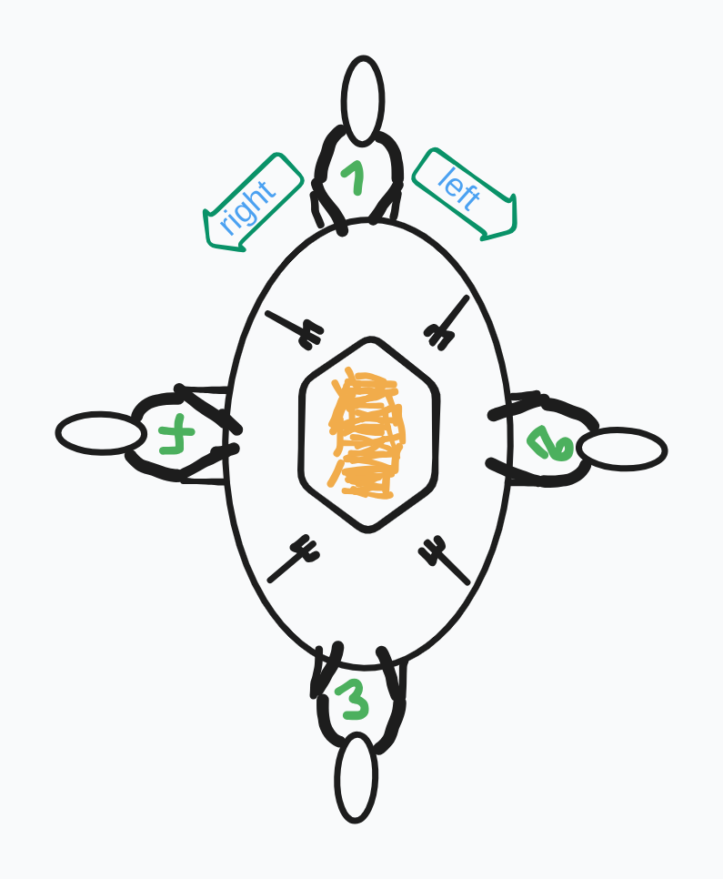

<!-- <h1>Philosophers</h1> -->

in philosophers project we have to solve <a href='https://en.wikipedia.org/wiki/Dining_philosophers_problem'>dining philosophers problem</a>

 the dining philosophers problem is an example problem often used to get an introduction to <a href="https://en.wikipedia.org/wiki/Concurrent_computing">concurrent programing</a> 

<h2>General idea</h2>

X amount of philosophers sit at a round table with bowls of food.

Each philosopher have a Fork placed in right of it(doesn't really change if they place it on the right or left).

Number of forks at a table is the same as philosophers.

Philosopher can do three things: eat, think or sleep.

 A philosopher cannot eat with one fork, so in order to eat he must pick up his fork and the fork on his left.

lets assume that we have four philosophers sitting at the tabe.

philosopher 1 wants to eat, so he take his fork and the fork on his left (fork of philo 4), philosophers 2 and 4 cannot eat because just one fork available for each one of them, philosopher 3 can eat if both of philo 2 and 4 don't take any fork

<h2>Resources</h2>

<a href='https://medium.com/@ruinadd/philosophers-42-guide-the-dining-philosophers-problem-893a24bc0fe2'>Philosophers 42 Guide Medium</a>
