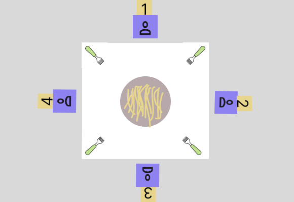
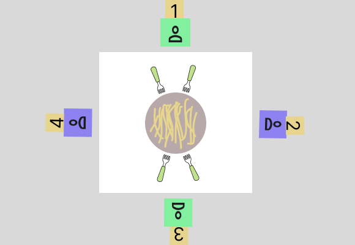

<h1>Philosophers</h1>
<h3>in philosophers project we have to solve <a href='https://en.wikipedia.org/wiki/Dining_philosophers_problem'>dining philosophers problem</a></h3>
<h3> the dining philosophers problem is an example problem often used to get an introduction to <a href="https://en.wikipedia.org/wiki/Concurrent_computing">concurrent programing</a> </h3>

<h2>General idea</h2>

- <h4>X amount of philosophers sit at a round table with bowls of food.</h4>
- <h4>Each philosopher have a fork placed in right of it (doesn't really change if they place it on the right or left).</h4>
- <h4>Number of forks at a table is the same as philosophers.</h4>
- <h4>Philosopher can do three things: eat, think or sleep.</h4>
- <h4>A philosopher cannot eat with one fork, so in order to eat he must pick up his fork and the fork on his left.</h4>

<h4>the target is to create an algorithm that manage the three activities (eat, sleep, think) for n philosophers in the optimal way that try as mush as can to avoid died of philosophers, with consider the constraints in the <a href='https://cdn.intra.42.fr/pdf/pdf/73397/en.subject.pdf'>subject</a></h4>

<h4>lets assume that we have four philosophers sitting at the table. there is one fork for each philos in his right (for example fork of philo 1 exist between him and philo 4)</h4>

<h4>as we mentioned above the philo cannot eat with one fork, so just two philos can eat in the same time, after they finish the two remaining philos can eating, one of solutions is to split the philos to two sets odd set and even set</h4>

<h2>Resources</h2>

<a href='https://medium.com/@ruinadd/philosophers-42-guide-the-dining-philosophers-problem-893a24bc0fe2'>Philosophers 42 Guide Medium</a>
