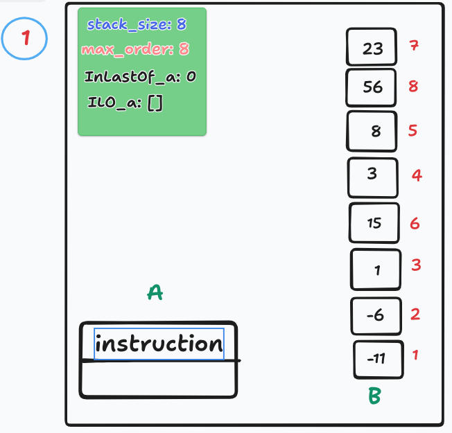
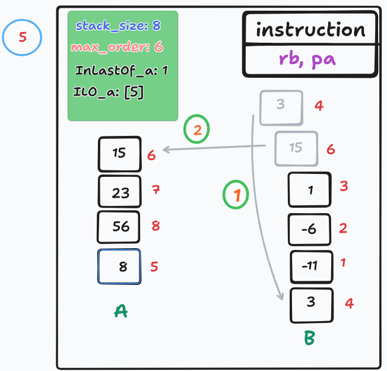

# P_S toturial
## simple explanation of chunks algorithm in push swap
- [X] ___first part contain three staeps___  
- ### (1) ranking the elements of stack `a` *`figure 2`*, once the numbers is ordered you can use just the order of each number to sort it
- ### (2) specifying the `stack_size` and the `midlle` of stack `a` and the `start` & `end` of chunk, and `set` of elements *`figure 3`*
- ### (3) searching about the elements of chunk and push each elements of chunk to stack `b` when the `chunk_size` = 0 expand chunk and repet this process *`figure 4,...,12`*
---
#### create stack `a` and represent it by a linked list data structur

---
#### ranking the elements of stack `a`, the rank of each number is represented by the red color in side it

---
#### initialize `stack_size` & `midlle` & `start` & `end` & `set`, varible `set` represent the chunk or range, `middle = stack_size/2`, `start = midddle - range_size/2`, `end = midddle + range_size/2`, `range_size` for your choise

---
#### if the element to be pushed is at the top of `a`, push it otherwise use `ra` until it is at the top

---
#### the same thing as the previos figure

---
#### the same thing as the previos figure

---
#### after pushing each element check if the order of this element is lower than the `midlle` if it lower use `rb` this operation make the stack `b` more organized than stack `a` and easily the sorting

---
#### expand chunk update `start` and `end` of chunk and add new numbers to (chunk) `set`

---
#### P_S

---
#### P_S

---
#### P_S

---
#### P_S

---
- [x] ___second part contain tow steaps___
- ### (1) specify the number that have the max order and push it to `a` `figure 2`, this steap is mandatory
- ### (2) complete the pushing of remaining numbers with follow the following conditions `figures [3,...,12]`
    - #### cond1: if the `max_order` in the top of `b` push it to `a`
    - #### cond2: if cond1 is False and the `max_order` existe in the last of `a` use `rra` to move it to the top of `a`
    - #### cond3: if both of cond1 and cond2 is False and the element that existe in the top of `b` lower than the element that in the last of `a` push it to `a` and rotate it by useing `pa` + `ra`
    - #### (4) if all of the previos conditions is False,  make the `max_order` in the top and push it to `a` there is tow way to make it in the top `rb` or `rrb` you should choise the way that give the least number of instructions
---
#### specify the `max_order` the `max_order` is the order of the larger number that has not taken its correct position, in first it will be the `stack_size`, once the larger number take the correct position `max_order` will decrement to be the order of the next larger number
#### `InLastOf_a` represent the number of elements in `a` bellow of the first `max_order` in this case the first `max_order` is 8 and `ILO_a` is the set of numbers that existe bellow of order 8

---
#### search about the max number and push it to `a`

---
#### cond3 has been achieved

---
#### no condition from the three conditions has been achieved, case (4) the choised way is `rrb`

---
#### no condition from the three conditions has been achieved, case (4) the choised way is `rb`

---
#### cond2 has been achieved

---
#### cond3 has been achieved

---
#### cno condition from the three conditions has been achieved, case (4) the choised way is `rrb`

---
#### cond2 has been achieved

---
#### cond1 has been achieved

---
#### cond1 has been achieved

---
### No more

